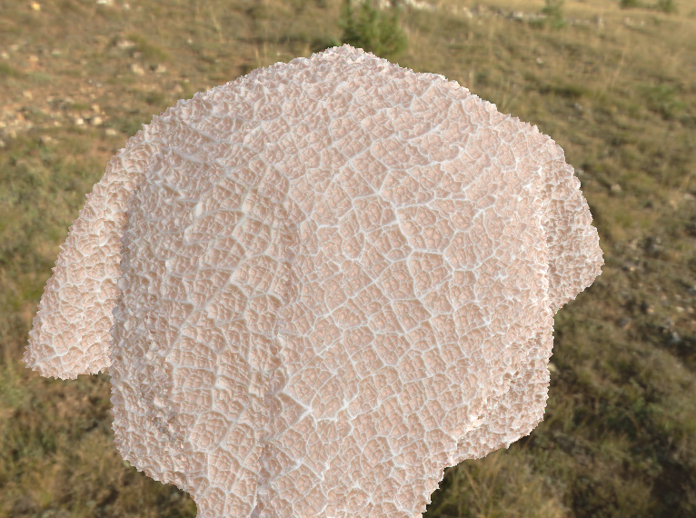

# Beef Belly Material

> Made in Substance Designer

## Result

## Content

- **.sbs** - Substance Designer editable file.
- **.pur** - PureRef scene file.
- **.jpg** - PureRef scene image export file.
- **[.jpg]** - Substance Designer renders.

## Reference

Need to collect some references from the Internet, let's Google: ***"Pancita Libro Mexican"***

_scene.jpg)